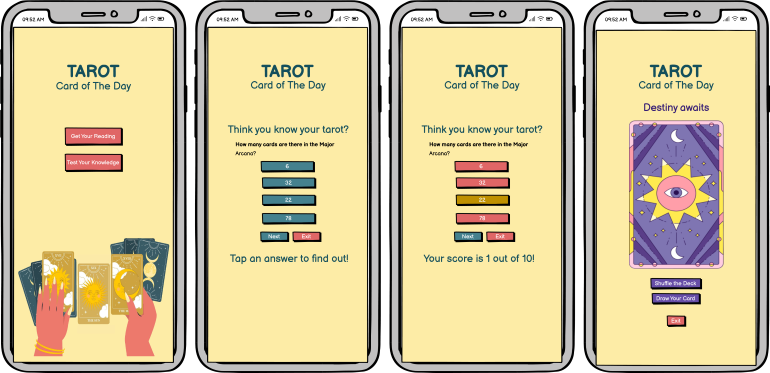
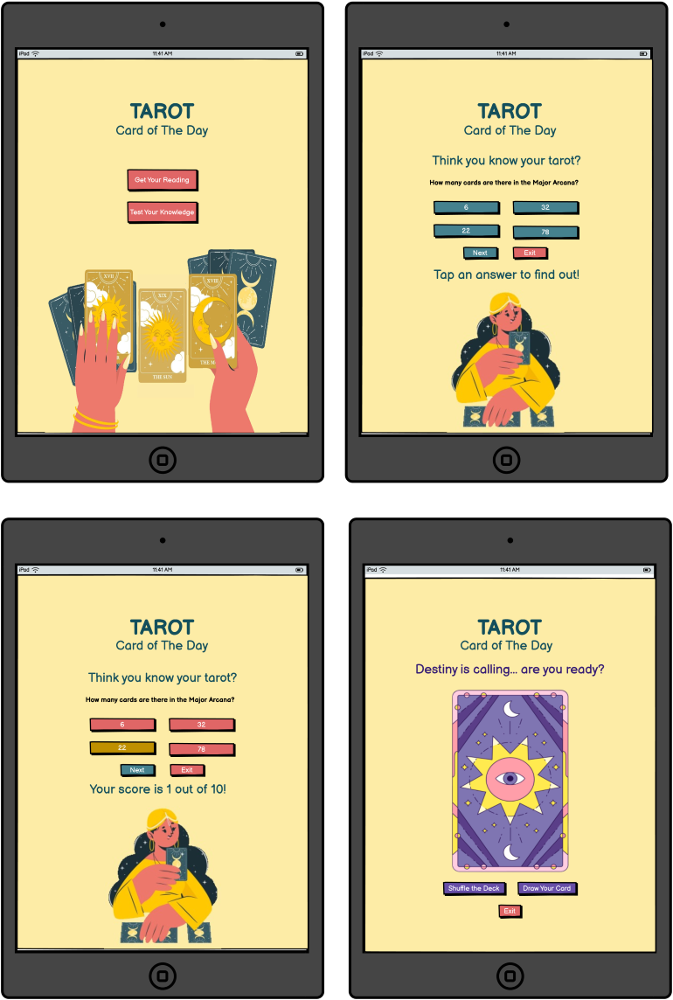
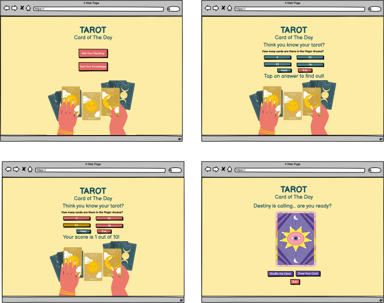

# Tarot

### User Stories 
- User Stories
   - As a new visitor, I want:
      - A cleanly designed and intuitive layout so I can easily navigate the site
      - An engaging experience with bright colors and sounds
      - A simple tarot draw that allows me to pick one card to guide my day, week, or specific question
      - A concise reading that I can engage with briefly or delve into for a deeper explanation 
      - A quiz with a simple format
      - A quiz that tests my knowledge of tarot cards and helps me to learn more about them
      - A points tally and a results feature that tells me how I've done
      - A button that allows me to exit the quiz or tarot draw when I wish
      - A fully responsive experience so that I can use any of my screens
    - As a returning visitor, I want:
      - A random selection of quiz questions so that I can test myself with fresh content
      - A random tarot draw so that I can get a new reading every time I visit
    - As the owner of the site, I want:
      - More than one interest point for the visitor: The choice between a tarot reading or a quiz
      - A site that is easily maintained yet continues to offer engagement for new and repeat visitors

### Wireframes

  
Planned and assembled in Balsamiq Wireframes

   
Mobile

   
   
Tablet

   
    
Laptop

   
  

### Future Features
- A glossary or dictionary of each of the Major Arcana cards and their meanings
- A history of a visitor's previous readings
- A multi-card reading option (3, 7)
- An explanded quiz with a larger number of questions to draw from
- An expanded tarot reading which draws from a full 78 card deck 

### Image Credits
Main Image: https://www.freepik.com/free-vector/tarot-concept-illustration_197101846.htm#position=1&from_element=collections Image by storyset on Freepik

Fortune Teller: Freepik (attribution to come)

Quiz Background: Freepik (attribution to come)

Tarot Card: https://www.freepik.com/free-vector/hand-drawn-tarot-cards-illustration_39555275.htm#fromView=search&page=2&position=24&uuid=e85cc8e3-0795-4d80-90d6-bc56a9b1ca1e Image by freepik

### Tutorials
Glowing Text Tutorial from w3 Schools, "How to Create A Glowing Text": https://www.w3schools.com/howto/howto_css_glowing_text.asp

JavaScript Toggle Tutorial from W3 Schools, "How TO - Toggle Hide and Show"
https://www.w3schools.com/howto/howto_js_toggle_hide_show.asp

JS for Quiz guided by tutorial from Code with Farraz: "Build a Quiz Application with HTML, CSS, and JavaScript" https://www.codewithfaraz.com/content/161/build-a-quiz-application-with-html-css-and-javascript-step-by-step-guide

Tutorial Credit: Stack Overflow: "Can I set an opacity only to the background image of a div?" https://stackoverflow.com/questions/7241341/can-i-set-an-opacity-only-to-the-background-image-of-a-div

*** Add remaining JS tutorials as noted in script.js; shimmer text css effect