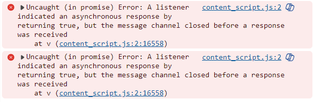

# **Tarot Card of the Day**
## *Your destiny awaits...*

  

[Visit the deployed site](https://erinvdoyle.github.io/tarot)

# **Introduction**

Welcome to **Tarot Card of the Day**, where the mystical meets the whimsical. This fully responsive, interactive website is designed to enchant its visitors with a daily dose of tarot wisdom. Punchy vector images and a bright color scheme keep the look and feel light-hearted and fun, while the 44 different cards in the Tarot Draw section provide a surprise factor and breadth of content to encourage return visits. The quiz offers an opportunity to test one's knowledge and learn more about the meaning of the cards. This site is designed to give the visitor a welcomed distraction (one could say a cosmic GPS for life's little questions!) from their day, one tarot card at a time.

# **Table of Contents**
- [Project](#project)
  - [User Stories](#user-stories)
- [User Experience](#user-experience)
  - [Wireframes](#wireframes)
  - [Site Structure](#site-structure)
  - [Design Choices](#design-choices)
- [Features](#features)
- [Future Features](#future-features)
- [Technologies](#technologies)
  - [Languages](#languages)
- [Testing](#testing)
  - [Code Validation](#code-validation)
  - [Responsiveness](#responsiveness) 
  - [Browser Compatibility](#browser-compatibility)
  - [Additional Testing](#additional-testing)
  - [Bugs](#bugs)
- [Deployment](#deployment)
- [Credits](#credits)
- [Acknowledgements](#acknowledgements)
- [Contact](#contact)

# Project 

This website was created for Portfolio Project #2 (JavaScript) for The Code Institute Full Stack Software Developer program.

It is intended for users of all age, race, and gender, from all walks of life. Tarot Card of the Day is for anyone who would enjoy taking a break from the daily grind to engage with their mystical side. Sense of humor required!

## User Stories
   

   
User Stories for Tarot Card of The Day (click)

 
 - **As a new visitor**, I want:
    - A cleanly designed and intuitive layout so I can easily navigate the site
    - An engaging experience with bright colors and sounds
    - A simple tarot draw that allows me to pick one card to guide my day, week, or specific question
    - The ability to draw more than one card and receive multiple fortunes
    - A quiz with a simple format
    - A quiz that tests my knowledge of tarot cards and helps me to learn more about them
    - A points tally and a results feature that tells me how I've done
    - A button that allows me to exit the quiz or tarot draw when I wish
    - A fully responsive experience so that I can use any of my screens  
   
 - **As a returning visitor**, I want:
    - A random selection of quiz questions so that I can test myself with fresh content
    - A random tarot draw so that I can get a new reading every time I visit

  - **As the owner of the site**, I want:
    - More than one interest point for the visitor: The choice between a tarot reading or a quiz
    - A site that is easily maintained yet continues to offer engagement for new and repeat visitors
    

# User Experience

## Wireframes

  
This project was planned and assembled in Balsamiq Wireframes (click)

   
Mobile

   
   
Tablet

   
    
Laptop

   
  

The wireframes were created for mobile, tablet, and desktop with a particular focus on mobile-friendly design.  Some changes to text, layout, and color choice have been made as the project evolved due to both accessability and design preference. 

## Site Structure

**Tarot Card of the Day** has two main game sections, as indicated by the bright red "Get Your Reading" and "Take the Quiz" navigation buttons at center screen. A fixed header displays the site logo, and a hero illustration of a Tarot draw takes the bottom screen of the starting area. This image is covered when either of the buttons are clicked. 

Each button clicks to its own game area instructions section, which occupies almost the entire viewport on click, starting below the header. Once the visitor has read the instructions for how to play, the game described is accessed through another button click, and the game section replaces the instructions. The visitor is offered the chance to exit and return to the starting area throughout each game.

More about each section and all of the features can be found in the [Features](<#features>) section.

## Design Choices

### Color Scheme

The color scheme for **Tarot Card of the Day** was inspired by the colors in the hero image. A color picker was used to extract shades of pale yellow, gold, red, teal, and dark blue. Pops of purple and pink accent the color palette and were lifted from the image used for the back of the tarot deck. I chose bold, hand-drawn vector illustrations to lend the site an extra dose of fun and nostalgia suitable for a gamefied tarot draw. While the tones are fairly dark, the creamy yellow background provides contrast and readability.

    
    
    

**Hex codes:**
- #fdf4ce, 
- #fdeca6, 
- #A97E10, 
- #d96b62, 
- #FF9EA9, 
- #7f75b2, 
- #385d65, 
- #2b464f, 

### Typography

- Fonts are provided by Google Fonts. "Uncial Antiqua": Headers and accent text. "Libre Baskerville": All other copy.
    
  

  
  

    
- The font "Uncial Antiqua" was chosen to evoke a mystical, fun, and old-time feel, like something one might see at a fair
     
  

  
  

- The font "Libre Baskerville" was chosen for readability and contrast so that all pertinent information could be read easily by visitors

# Features

I have aimed to give this site a simple, intuitive interface. Ease of navigation allows the visitor to engage with their game of choice without delay. 

Examples of this site's interactive features include:
 
- Sound toggle buttons
- Sound effects and animations for correct and incorrect answers
- Sound effects and animations througout the tarot draw 
- The option to exit out of whichever game is being played
- A quiz results blurb determined by the number of points scored

## Favicon

- The favicon features a pair of ace cards to indicate the content matter

## Header

  - The header is in a fixed position and remains static at the top of the page
  - It can be clicked at any point to return the visitor back to the main starting area

## Hero Image

- This vector illustration provides the visitor's first impression of Tarot Card of the Day and sets the tone and color scheme. It is fixed to the bottom of the starting area and is covered when the user navigates into either of the main game sections

## Main Navigation Buttons

- Stop sign red navigation buttons with a slight gradient grab the visitors attention from center screen

## Tarot Draw Section

### Instructions

#### h3

- Each section features an h3 element to introduce the content below. This one has a gold gradient background as I felt the metallic appearance was reminiscent of gold coins and kept with the fortune teller theme

#### Instructions content

- The instructions section explains how to play the Tarot Draw game, step by step. The game navigation buttons are replicated for ease of understanding 

#### Instructions image

- An image of a tarot mystic keeps the instructions section fun and true to tone. Border radius on the top corners lends visual interest and compliments the hand-drawn style of illustation 

#### Navigation button to "Get your Reading!"

### The Tarot Draw

#### h3 

- This header gives the visitor their first direction to play the game: Tap the deck!

#### Tarot Deck

- The Tarot Deck starting mode is the deck of cards, featuring the back of one of the cards

- When the visitor clicks on the deck, as instructed in the h3 above it, the deck shakes and plays a shuffle sound

- There are three navigation buttons: The sound toggle, the "Draw" button" and the "Exit" button

- When the visitor taps "Draw", a magical chime sound plays, and a card is chosen at random and displayed
  - An h3 banner appears below the card, instructing the visitor to tap the card again to read its meaning

  

- When the card is tapped, the h3 disappears, and the card meaning or fortune is revealed

- From this point, the visitor can choose to "Redraw" another card and repeat the same process for a new fortune, or "Exit" back to the starting area

#### Navigation Buttons

- As described above in the Tarot Deck section, there are three buttons: A sound toggle, which can be activated at any time; A Redraw button, which allows the visitor to draw a different card; and an Exit button, which clicks back to the starting area

## Tarot Quiz Section

### Instructions 

#### h3

#### Instructions Content

#### Navigation Button

### The Tarot Quiz

#### h3

#### Quiz Content

- The quiz is laid out with question, answer options, and internal navigation buttons in the same container

- Once the visitor has read the question, they can click on their answer choice

- Each answer vibrates when a choice is made, with the correct answer momentarily enlarging and changing to a green background color, while the incorrect answers change to a red background with text struck through

- A "Next" button appears when the answers are revealed so that the visitor may advance to the next question. This button disappears once clicked until the next question is answered so that no questions may be skipped

- An h3 banner appears below the quiz container when the visitor chooses their answer to the first question. This banner displays the score and changes background color either to green for correct or red for incorrect. This banner resets to its standard background color when the "next" button is clicked and the visitor advances to the next question

- Once all ten questions have been answered, the final score is displayed and the Next button is replaced with a Results button

#### Results Section

- The results section features a cheeky blurb based on the success (or lack thereof) of the visitor's quiz results. There are three grades based on points total, from 0-3, 4-6, and 7-10

#### Navigation Buttons

- There are four navigation buttons: A Next button, which is hidden or displayed based on whether the visitor has answered the question; an Exit button, which exits to the main area at any time; a Sound Toggle; and a Results button, which replaces Next after all the questions have been answered  

# Future Features
- A glossary or dictionary of each of the Major Arcana cards and their meanings
- A history of a visitor's previous readings
- A multi-card reading option (choices of 3 or 7 with an expanded meaning section)
- An updated quiz with a larger number of questions to draw from
- An expanded tarot reading which draws from a full 78 card deck 

# Technologies

## Languages Used
- [JavaScript](https://www.javascript.com/) - provides the majority of application functionality
- [HTML](https://html.spec.whatwg.org/) - provides the framework and content
- [CSS3](https://www.w3.org/Style/CSS/Overview.en.html) - provides the styling

## Frameworks, Libraries, and Software
- [Am I Responsive](https://ui.dev/amiresponsive) - to check site responsiveness
- [Balsamiq](https://balsamiq.com/wireframes/) - to create first draft wireframes for the site
- [ChatGPT](https://openai.com/chatgpt/) - for initial quiz and tarot copy inspiration which was tweaked for style and tone
- [Code Beautify](https://codebeautify.org) - for final formatting checks
- [Coolors](https://coolors.co/) - to provide the README color palette
- [Font Awesome:](https://fontawesome.com/) - for sound toggle icon
- [Freepik](https://www.freepik.com) - for all of the images
- [Github](https://github.com/) - to host the site
- [Gitpod](https://www.gitpod.io/#get-started) - to create, edit, and deploy the site
- [Google Chrome DevTools](https://developer.chrome.com/docs/devtools/) - to test the website 
- [Google Fonts](https://fonts.google.com/) - for the use of "Uncial Antiqua" and "Libre Baskerville"
- [Icons8](https://icons8.com/) - for playing cards favicon
- [Image Color Picker](https://www.imagecolorpicker.com) - to extract color palette from illustrations
- [JSHint](https://jshint.com/) - for JavaScript validation
- [Lighthouse](https://developer.chrome.com/docs/lighthouse/overview/) - to review site performance and accessibility
- [Pixabay](https://www.pixabay.com) - for all site audio
- [Shields.io](https://shields.io/badges) - for README color badges
- [Squoosh](https://squoosh.app/) - for image compression
- [W3C](https://validator.w3.org/) - to validate HTML and CSS
- [Wave Web Accessibility Evaluation Tool](https://wave.webaim.org/) - to test site accessibility

# Testing

## Feature Testing 

  
Testing the Main Navigation Buttons (click)
 

- The "Get Your Reading" button clicks to the Tarot Draw Instructions Page
- The "Test Your Knowledge" Button clicks to the Tarot Quiz Instructions Page

  
Testing Tarot Reading Instructions Navigation Button (click)
 

- The "Get Your Reading Button" clicks through to the Tarot Draw Section

  
Testing the Tarot Draw Section (click)
 

- The h3 banner above the Tarot Deck instructs the user to Tap the Deck to shuffle
- The Deck plays a shuffle sound and shakes onclick
- The Sound Toggle turns sound off and on and the icon changes to reflect the status
- The Draw button plays a chime sound and the top card of the deck changes to the drawn card
- An h3 banner appears below the deck instructing the visitor to tap the card for meaning. It disappears when the deck is tapped
- The card flips to its meaning when the deck is tapped
- The Redraw button correctly plays the chime sound and restarts the draw process
- The Exit button returns the visitor to the main starting area

  
Testing the Tarot Quiz Instructions Navigation Button (click)
 

- The "Take the quiz" button naviagtes to the Tarot Quiz Section

  
Testing the Tarot Quiz Section (Pictured)
 

- The question appears with four clickable answers beneath it
- The buttons change color when hovered over
- The answers vibrate when a selection is made. The correct answer changes background color to green and momentarily enlarges. The incorrect answers change background color to red and the text is struck through. The Next button appears to allow advancement to the next question
- The next button disappears until the next question is answered
- The h3 banner beneath the quiz container changes color to red or green based on whether the answer is correct and the points tally is updated. The banner returns to its base background color once the quiz is advanced and until the next question is answered
- The Sound Toggle works to allow the visitor to turn the sound on or off
- The exit button return to use to the starting area
- The Results button appears after the tenth question is answered
- The results blurb corresponds to the number of correct answers as designed

### Feature Testing Table

 
A Table of Feature Tests (click)

| Feature                     | Test Case                 | Outcome                   |
|-----------------------------|---------------------------|---------------------------|
| Favicon | Load Site | Icon and title appear in tab |
| Header | Click text | Page refreshes |
| Header | Scroll (on mobile and DevTools small screens) | Header remains fixed |
| **Starting Area**  |
| Hero Image | Load page | Image loads quickly |
| Main Navigation Button #1 | Click "Get Your Reading" button | Tarot Reading Instructions section loads|
| Main Navigation Button #2 | Click "Take The Quiz" button | Tarot Quiz Instructions section loads |
| **Tarot Draw Instructions Section**  |
| Tarot Draw Instructions Section | Open Instructions section by clicking "Get Your Reading" button |Section loads and fills viewport below header 
| Tarot Draw Instructions Section | Read content, scroll page on smaller screens | Content is legible and scrolls as intended |
| Tarot Draw Instructions Image | Open Instructions section by clicking "Get Your Reading" button | Image loads properly and is centered on the x-axis |
| Navigation Button to Tarot Reading Section | Click "Get Your Reading!" | Tarot Draw Section replaces Tarot Draw Intructions Section|
| **Tarot Draw Section**  |
| Tarot Deck | Click or Tap Deck | Shuffle sound plays|
| Tarot Deck | Click or Tap Deck | Deck Shakes |
| "Draw" Button | Click button | Chime sound |
| "Draw" Button | Click button | Tarot card is displayed |
| "Draw" Button | Click button | Lower h3 appears |
| Card Meaning | Tap deck as instructed | Card flips to reveal meaning |
| Card Meaning | Tap deck as instructed | Lower h3 disappears |
| "Redraw" Button | Click button | A new card appears in place of the current card and can now be tapped for its own meaning |
| Sound Toggle | Click On and Off through all stages of play | Sound turns on and off as intended |
| "Exit" Button | Click button | Page refreshes and Tarot Draw section is replaced by Starting Area |
| **Tarot Quiz Instructions Section** |
| Tarot Quiz Instructions Section | Open Instructions section by clicking "Take the Quiz" button |Section loads and fills viewport below header |
| Tarot Quiz Instructions Section | Read content, scroll page on smaller screens | Content is legible and scrolls as intended |
| Navigation Button to Tarot Quiz Section | Click "Take the quiz!" | Tarot Quiz Section replaces Tarot Quiz Intructions Section|
| **Tarot Quiz Section**|
|Tarot Quiz Section | Navigate into Tarot Quiz Section | Quiz with question, answers, and navigation buttons loads |
| Answer option buttons | Click button to select answer - **incorrect** | Incorrect answers turn red while correct turns green |
| Answer option buttons | Click button to select answer - incorrect | Answer buttons vibrate |
| Answer option buttons | Click button to select answer - incorrect | Incorrect text is struck through |
| Answer option buttons | Click button to select answer - incorrect | Wrong answer buzzer sounds |
| Answer option buttons | Click button to select answer - **correct** | Correct answer turns green while others turn red |
| Answer option buttons | Click button to select answer - correct | Answer buttons vibrate |
| Answer option buttons | Click button to select answer - correct | Correct answer briefly expands |
| Answer option buttons | Click button to select answer - correct | Correct answer buzzer sounds |
| Lower h3 Points Tally | Play quiz | Background color changes to green or red based on correct or incorrect answer |
| Lower h3 Points Tally | Play quiz | Score tally updates with each answer |
| "Next" button | Click button to advance to next question | Button appears once question has been answered |
| "Next" button | Click button to advance to next question | Button advances quiz "onclick" to next question | 
| "Next" button | Click button to advance to next question | Button disappears until current question is answered so that all ten questions must be answered |
| Sound Toggle | Click speaker icon throughout different questions of the quiz | Sound toggles on and off as instructed |
| "Get Results" button | Answer all ten questions and click button |Button appears after tenth question has been answered and brings visitor to the results area |
| Results area | Click "Get Results" button | Visitor is brought to intended results blurb as determined by points tally |
| "Exit" button | Click button at different stages of play | Button returns visitor to starting area |

## Code Validation

| W3 Validator | index.html | 
|--------------|------------|
| html         | Pass       |
| CSS          | Pass       |
| JavaScript          | Pass       |

No errors were returned in any of the three code validators

### HTML Validation
- [W3C HTML Validator](https://validator.w3.org/) -

    
HTML Validation Screenshot (click)

     
     
No errors were returned

  

### CSS Validation
- [W3C CSS Validator](https://jigsaw.w3.org/css-validator/) -

    
CSS Validation Screenshot (click)

     
     
No errors returned

  

### JavaScript Validation
- [JSHint JavaScript Validator](https://) -

    
JavaScript Validation Screenshot (click)

     
     
     
No errors returned. Three unused variables were noted, but each of these is a function used in the quiz game

  

## Responsiveness Test
- All pages have been tested for responsiveness through both Chrome and Edge DevTools at the following CSS breakpoints:
    - Mobile S (320px)
    - Mobile M (375px)
    - Mobile L (425px)
    - Tablet (768px)
    - Laptop (1024px)
    - Laptop (1440px)

### Screenshots of each section of the site as tested in Chrome DevTools

  
Screenshots of the Starting Area (click)

  
Screenshots of the Tarot Quiz Instructions (click)

  
Screenshots of the Tarot Quiz (click)

  
Screenshots of the Tarot Quiz Results (click)

  
Screenshots of the Tarot Draw Instructions (click)

  
Screenshots of the Tarot Draw (click)

## Browser Compatibility

| Browser Tested          | Intended Appearance | Intended Responsiveness |
|-------------------------|---------------------|-------------------------|
| Chrome (Mobile/Desktop) | Good                | Good                    |
| Edge (Mobile/ Desktop)  | Good                | Good                    |
| Safari (Mobile)         | Good                | Good                    |

## Additional Testing

### Lighthouse

  
Lighthouse Test Results (click)
 

  
Lighthouse Test Results (click)
 

### WAVE Testing

  
WAVE Web Accessibility Evaluation Tool (click)
 

After changing the header and navigation buttons to darker colors for better contrast, the site passed the WAVE evaluation with zero contrast errors. One error and two alerts were highlighted:

- The error is due to an "empty" button, which is actually the Sound Toggle for the Tarot Draw section. This button is not empty but uses the Font Awesome speaker icon rather than text 

- The first alert is due to a device dependent event handler. This concerns the shake animation for the tarot deck when clicked. While the deck does shake on mobile screens, this animation does not function with the same reliability as it does on desktop. However, the shuffle sound that accompanies it does play on mobile so I felt justified in leaving the animation as a bonus feature

- The second alert concerns the audio tag for the deck shuffle sound. I have added an aria-label for accessibility to address this alert

### Accessibility
This website was developed with special consideration for accessibility through the following methods:
- The use of semantic HTML
- Alt text for images
- Appropriate contrast levels between background and foreground features and background colors and text.
- 100% Lighthouse testing scores for Accessibility and SEO on both Mobile and Desktop formats

### Manual Testing

- Manual testing has been performed on an iPhone 11 and iPhone 13Pro using Safari and Chrome, as well as on three Windows laptops of differing screen sizes. [https://ui.dev/amiresponsive](https://ui.dev/amiresponsive) provided the screenshot for the top of this README and allowed further testing of site responsiveness. 

  
Screenshots of each section of the site as tested on Am I Responsive? (click)

   
   
   
   

  
Screenshots of each page of the site as tested on my own device, iPhone 13Pro (click)

   
   
   
   

# Bugs

## Solved Bugs

  
Misplaced Event Listeners (click)

These errors occurred while writing showMeaning(). This function utilizes CSS flipcards to show the meaning of the displayed card when the deck is tapped. Due to the several sides of card and the overall complexity of the drawCard function, I misplaced the needed event listener and also struggled with selecting the proper element. I worked through these errors through trial and error, using gitpod's port to preview the implementation of the functions

  
A missing stylesheet semicolon that affected the layout (click)

Several hours were spent trying to debug my JavaScript as I failed to recognize an obvious syntactical error in my CSS. I learned the importance of my working tree as I retraced each change between commits until I found the culprit: A missed semicolon

  
A missing comma in script.js that broke the entire site! (click)

No image for this one as there was no visible error; the main navigation buttons simply stopped working and neither of the gameplay areas were accessible. I consulted the differences in code between my recent commit and the one before it and realized my mistake. After updating my tarotDeck array in JavaScript, I neglected to place a comma after one of the array items

## Unsolved Bugs

After implementing the above solutions and running all code through the necessary validators, one console error remains when I view the site through Microsoft Edge 

  
Uncaught (in promise) Error (click)

After consulting my mentor, Precious, and searching the error on Stack Overflow, I have come to the conclusion this console error is likely due to a plugin on my browser. It does not show up in incognito mode on my latop, in Microsoft Edge on my second test laptop, or at all on Precious' computer

There are no further unsolved bugs, but there are a couple areas on mobile screens that do not function entirely as designed. Neither of the issues affect the overall performance of the site or impede gameplay:

- The shake effect when the tarot deck is tapped does not reliably work on Safari or Chrome mobile. A sustained tap usually results in an OS pop up to "Share" or "Save to Photos". Sometimes this can be avoided and the deck shakes properly

- The glow on the header h2 appears harsher on mobile devices than desktop, which creates slightly more contrast than intended between the text and the background

# Deployment

## To Deploy The Project

  
How to Deploy (click)
 

This site was deployed through GitHub repository [/erinvdoyle/tarot](https://github.com/erinvdoyle/tarot)

1. Follow the link above and click the Settings tab in the top navigation bar

2. From there, navigate to the Code and Automation section on the left side of the screen. Click the Pages tab

3. Under the "Build and deployment" header, click the drop down menu "Deploy from a branch," located under Source

4. Under Branch, select "main" with folder "/root". Click Save. Congratulations, your site is now deployed

## To Fork The Repository on GitHub

  
How to fork the Tarot repository (click)

To make a copy of a repository, fork it through Github:

1. Find the repository either by using the search bar or by navigating to the URL [/erinvdoyle/tarot](https://github.com/erinvdoyle/tarot)
2. Once on the repository main page, navigate to the "Fork" button in the upper-right corner, between the "Watch"(/"Unwatch") and "Star" buttons

3. Click the "Fork" button to create a copy of the repository. This can now be altered without affecting the source code

## Creating A Local Clone of The Project

  
How to create a local clone (click)

To clone the repository of this site:

1. Click the "Code" button in your forked repository

2. Copy the repository URL (HTTPS, SSH, or GitHub CLI)
3. Open a terminal (or command prompt) on your computer

 

4. Type the following command: git clone https://github.com/erinvdoyle/tarot.git to create a local clone

# Credits

## Content

## Technical Content

All tutorials used have been credited throughout the code. Tutorials were used as a jumping off point and code was manipulated to perform per my own design and specification

### CSS Tutorials
[Glowing text tutorial from w3 Schools, "How to Create A Glowing Text":](https://www.w3schools.com/howto/howto_css_glowing_text.asp)

[Background image opacity tutorial from Stack Overflow: "Can I set an opacity only to the background image of a div?":](https://stackoverflow.com/questions/7241341/can-i-set-an-opacity-only-to-the-background-image-of-a-div)

[Custom scroll bar tutorial from W3 Schools, "How to Create a Custom Scroll Bar":](https://www.w3schools.com/howto/howto_css_custom_scrollbar.asp)

[Shaking an image tutorial from W3 Schools, "How to Shake an Image with CSS":](https://www.w3schools.com/howto/howto_css_shake_image.asp) 

[Flip Card tutorial from W3 Schools, "How to Create CSS Flip Cards":](https://www.w3schools.com/howto/howto_css_flip_card.asp )

[CSS 2d Transforms tutorial from W3 Schools:](https://www.w3schools.com/Css/css3_2dtransforms.asp) 

### JavaScript Tutorials

[Toggle Tutorial from W3 Schools, "How TO - Toggle Hide and Show":](https://www.w3schools.com/howto/howto_js_toggle_hide_show.asp)

[Building a Quiz Application from Code with Farraz, "Build a Quiz Application with HTML, CSS, and JavaScript"](https://www.codewithfaraz.com/content/161/build-a-quiz-application-with-html-css-and-javascript-step-by-step-guide)

[Build a Quiz App with JavaScript from Web Dev Simplified:](https://youtu.be/riDzcEQbX6k) 

["How to Make a Quiz App using HTML CSS Javascript - Vanilla Javascript Project for Beginners Tutorial" from Brian Design:](https://www.youtube.com/watch?v=f4fB9Xg2JEY) 

[Building an Interactive Quiz tutorial from Codepicker57:](https://medium.com/@codepicker57/building-an-interactive-quiz-with-html-css-and-javascript)

[Tutorial for playing a sound with JavaScript from Sabe.io:](https://sabe.io/blog/javascript-play-sound-audio)

[Tutorial for how to shuffle an array of items from FreeCodeCamp.org:](https://www.freecodecamp.org/news/how-to-shuffle-an-array-of-items-using-javascript-or-typescript/) 

[How to randomly shuffle a JavaScript array, question asked on Stack Overflow:](https://stackoverflow.com/questions/2450954/how-to-randomize-shuffle-a-javascript-array)

[How to code a card deck in JavaScript:](https://www.thatsoftwaredude.com/content/6196/coding-a-card-deck-in-javascript)

[How to utilize Child Nodes:](https://developer.mozilla.org/en-US/docs/Web/API/Node/childNodes)

## Media
### Image Credits
[Main Image by Storyset on Freepik:](https://www.freepik.com/free-vector/tarot-concept-illustration_197101846.htm#position=1&from_element=collections)

[Fortune Teller by Storyset on Freepik](https://www.freepik.com/free-vector/fortune-teller-concept-illustration_69243555.htm#fromView=author&page=1&position=15&uuid=2285f5b2-3dab-4c5c-89a4-8f8ceb41fcb1)

[Main Tarot Card image by Freepik](https://www.freepik.com/free-vector/hand-drawn-tarot-cards-illustration_39555275.htm#fromView=search&page=2&position=24&uuid=e85cc8e3-0795-4d80-90d6-bc56a9b1ca1e)

[Tarot Cards Collection 1 by Freepik](https://www.freepik.com/serie/39555281)

[Tarot Cards Collection 2 by Freepik](https://www.freepik.com/serie/39555272)

[Tarot Cards Collection 3 by Freepik](https://www.freepik.com/serie/39110667)

[Tarot Cards Collection 4 by Pikisuperstar on Freepik](https://www.freepik.com/serie/38600027)

[Tarot Eye](https://www.freepik.com/free-vector/hand-drawn-celestial-pattern-design_137950070.htm#position=3&from_element=collections)

[Quiz Background by RawPixel.com on Freepik](https://www.freepik.com/free-vector/celestial-object-sketch-set-beige-background_16446731.htm#position=6&from_element=collections)

[Quiz Results Image by Studiogstock on Freepik](https://www.freepik.com/free-vector/esoteric-hand-mystical-icon_136483400.htm)

### Sound Credits 
[Wrong answer Sound Effect by Nhựt Bùi on Pixabay](https://pixabay.com/sound-effects/buzzer-or-wrong-answer-20582/)

[Correct answer Sound Effect from Pixabay](https://pixabay.com/sound-effects/correct-6033/)

[Shuffle Sound Effect from Pixabay](https://pixabay.com/sound-effects/shuffleandbridge-107641/)

[Draw Card Chime from Pixabay](https://pixabay.com/sound-effects/chime-and-chomp-84419/)

### Other Resources

# Acknowledgements
- My mentor, Precious Ijege
- Our cohort standup leader, Laura Mayock

# Contact
Thank you for viewing my project. Please feel free to contact me with any questions or comments
  
 - [erin.v.doyle@gmail.com](mailto:erin.v.doyle@gmail.com)
 - [linkedin.com/erinvdoyle](https://linkedin.com/erinvdoyle)